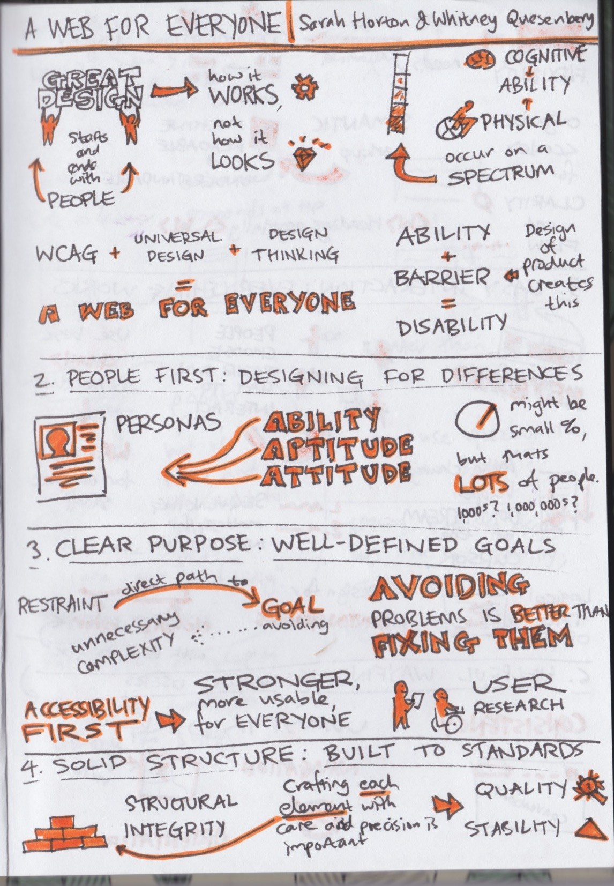

theme: poster

## *CTFEDs*
# Open Design Cape Town

---

# Intros

^ Of us three

---

# Table intros
## Grab a pen and stickies

---

### *What do you want to learn?*
### *What does* open *mean to you?*
### *What are you here today?*

---

## Share with 3 people at your table

---

# Lean Coffee :coffee:

^ Anyone familiar?
Demo time!
1. Kanban
2. Dot vote
3. Check-ins every 5m

---

## *Pick a topic table*
## (or make a new one!)

^ new ones after the break

---

## *Write down agenda ideas*
## 1 per sticky

---

## *Dot vote*
## 2 dots each

---

## *Order by votes*
## Move first one to **Discussing**

---

## *Make notes*
## Ideas, not art

^ on the big paper

---

---

# **Discuss!**

---

# Table feedback

^ We three talk through

---

## *Handouts*
## What I learned
## What I'm going to do

---

# *Break!*
## (actual :coffee:)

---

# Comment on the meetup

---

# Thanks! *:)*
